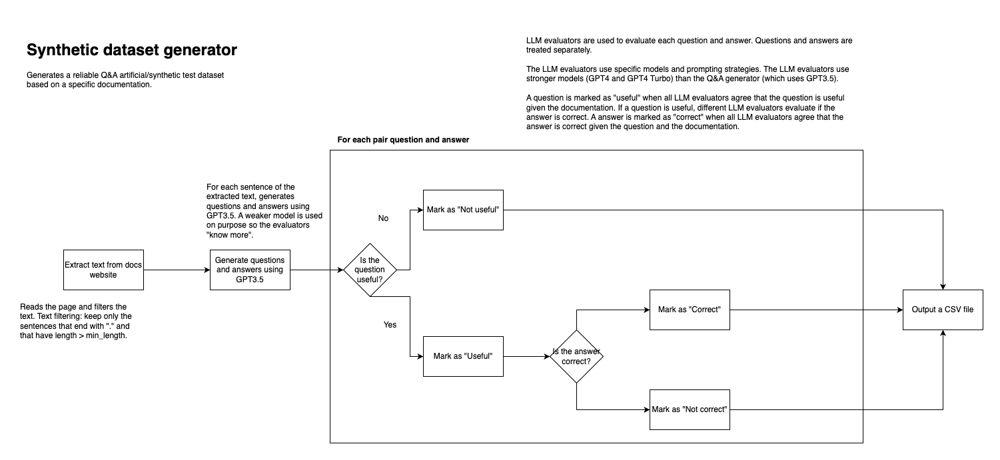

# Synthetic Dataset Generator

## Overview

This Python script creates a synthetic Q&A dataset based on a specific web page. It includes functionalities for extracting text from HTML pages, generating questions and answers from documentation, and evaluating the relevance and accuracy of these questions and answers using different versions of GPT models.

The main idea of the script is described in the following image:




## Prerequisites

- Python 3.x
- Libraries: see `requirements.txt`

## Installation

1. Clone the repository or download the script.
2. Install required libraries using `requirements.txt`:
   ```
   pip install -r requirements.txt
   ```

## Configuration

- Set up an `.env` file with your OpenAI API key:
  ```
  OPENAI_API_KEY='your_api_key_here'
  ```

## Usage

### Web Scraping

- `extract_text_from_html(url)`: Extracts and cleans text from a given HTML URL.

### Text Processing

- `process_text(text, min_length=250)`: Filters and processes text based on length and punctuation.
- `read_text_file(file_path)`: Reads text from a file.
- `write_to_file(content, file_path)`: Writes content to a file.

### Interaction with OpenAI's GPT Models

- `get_llm_response(user_prompt, system_prompt, model="gpt-3.5-turbo", temperature=0)`: Generates responses from GPT models based on prompts.
- `generate_questions_and_answers(lines, question_system_prompt, answer_system_prompt)`: Generates a DataFrame with questions and answers based on provided text.
- `evaluate_questions_gpt4(row)`: Evaluates questions using GPT-4 model.
- `evaluate_questions_gpt4_turbo(row)`: Evaluates questions using GPT-4 Turbo model.
- `evaluate_answers_gpt4(row)`: Evaluates answers using GPT-4 model.
- `evaluate_answers_gpt4_turbo(row)`: Evaluates answers using GPT-4 Turbo model.

### Execution Flags

- Set `run_extract_text_from_html`, `run_questions_and_answers_generation`, `run_questions_evaluation`, `run_evaluate_answers` to `True` or `False` to enable or disable specific functionalities.

## Output

- The script generates CSV files with questions and answers, and their evaluations.